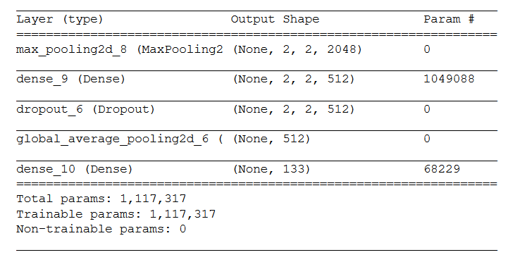

# Dog Breed Classifier

A basic classifier application that takes an image and predicts the breed of dog. In case the image of a face has been provided, the application outputs the most similar looking dog breed.

## Running the app

To get a copy of the project up and running on your local machine:

1. Download a copy of the repository to your local machine

2. Refer to the requirements and get the requisite packages installed
```pip install -r /path/to/dog-breed-classifier/requirements.txt```

3. Execute ```streamlit run app_dog_breeds.py``` on your terminal

4. Choose any of the sample images from the ```images_temp``` folder to test out the app

Note: I don't own any of the images in the specified folder and these are just provided so that we can test out the app out of the box. Please feel free to use your own images.

## Project Overiew

The problem statement is to classify the given dog image of dog to determine the breed of dog. The problem has been solved using CNNs. In particular, Inceptionv3 pretrained model is used for feature extraction and the final step of the network is modified to classify the image into one of the 133 dog breeds that were available in the input trianing dataset.

### Strategy

The problem has been divided into two steps, the first being detection of a dog/human face in the image. Subsequently, if a dog/face is detected in the input image, the classification is carried out with the help of Inceptionv3 pretrained network as described above.
 
#### Step 1: Detection of dog/face in image

1. OpenCV's implementation of [Haar feature-based cascade classifiers](http://docs.opencv.org/trunk/d7/d8b/tutorial_py_face_detection.html) to detect human faces in images.  The xml file was sourced from the link that follows - [github](https://github.com/opencv/opencv/tree/master/data/haarcascades)

    - The classifier showed good performance on the sample datasets - with 100% accuracy in detecting faces, while it detected ~11% of dog images as faces

2. A pre-trained [ResNet-50](http://ethereon.github.io/netscope/#/gist/db945b393d40bfa26006) model was used to detect dogs in images.  The weights that have been trained on [ImageNet](http://www.image-net.org/) were used and the category corresponding to dogs used with help fo the [dictionary](https://gist.github.com/yrevar/) (keys 151-268).

    - This classifier had a good performance as well, with 100% dog images detected from our sample dataset and 0% human faces detected as dogs

#### Step 2: Classification of dog/face to the dog breed

A pre-trained Inceptionv3 model is used for feature extraction and subsequent layers are modified to suit the use case with 133 dog breeds. Please follow the notebook provided in this repo (```dog_breeds.ipynb```) for further information.

A snapshot of the architecture (post pretrained Inceptionv3 features) is added below for reference.



### Instructions to get the notebook running

The notebook will help you with additional steps that were taken to arrive at the project objectives. Please follow the steps below to get the notebook up and running. Alternately, use the html file provided to get a static view of the analysis

1. Clone the repository and navigate to the downloaded folder.
```	
git clone https://github.com/mdash/dog-breed-classifier
cd dog-breed-classifier
```

2. Download the [dog dataset](https://s3-us-west-1.amazonaws.com/udacity-aind/dog-project/dogImages.zip).  Unzip the folder and place it in the repo, at location `path/to/dog-breed-classifier/dogImages`. 

3. Download the [human dataset](https://s3-us-west-1.amazonaws.com/udacity-aind/dog-project/lfw.zip).  Unzip the folder and place it in the repo, at location `path/to/dog-breed-classifier/lfw`.  If you are using a Windows machine, you can use [7zip](http://www.7-zip.org/) to extract the folder. 

4. Donwload the [VGG-16 bottleneck features](https://s3-us-west-1.amazonaws.com/udacity-aind/dog-project/DogVGG16Data.npz) for the dog dataset.  Place it in the repo, at location `path/to/dog-breed-classifier/bottleneck_features`.

5. (Optional) __If you plan to install TensorFlow with GPU support on your local machine__, follow [the guide](https://www.tensorflow.org/install/) to install the necessary NVIDIA software on your system.  If you are using an EC2 GPU instance, you can skip this step.

6. Open the notebook.
```
jupyter notebook dog_app.ipynb
```

### Prerequisites

Please refer to the ```requirements.txt``` file for packages that are required for executing the app and install using pip.

## Acknowledgments and Inspiration

A big thanks to the Udacity team for putting together the idea and boilerplate code base for this wonderful project!
