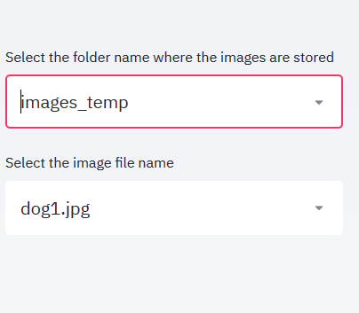
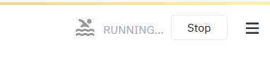
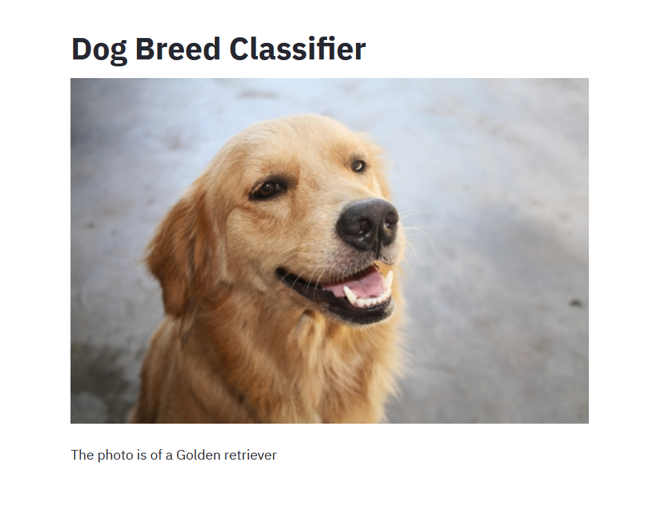
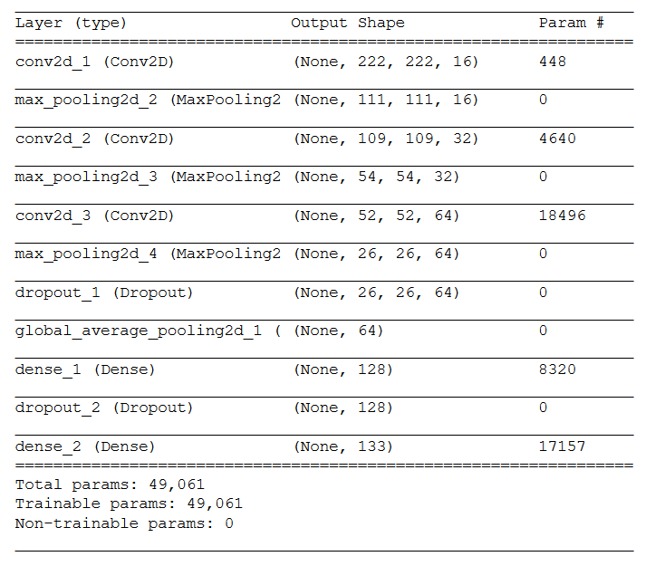

# Dog Breed Classifier

A basic classifier application that takes an image and predicts the breed of dog. In case the image of a face has been provided, the application outputs the most similar looking dog breed.

## Running the app

To get a copy of the project up and running on your local machine:

1. Clone the repository and navigate to the downloaded folder. Run the code below in your terminal CLI:
    
    ```	
    git clone https://github.com/mdash/dog-breed-classifier
    cd dog-breed-classifier
    ```

2. Refer to the requirements and get the requisite packages installed. Run the code below in your terminal CLI

        pip install -r requirements.txt

    If you use anaconda, first run the command below in your terminal CLI before the command above
        
        conda activate

3. Next, execute the following command on your terminal CLI
    
        streamlit run app_dog_breeds.py

4. This should open up a browser window with the app running on it.

5. If this is the first app run, Please give the app a few minutes to download the pretrained models from TensorFlow. Keep a close watch on your terminal window for download progress before using the app.

6. Use the dropdown on the app to choose any of the sample images from the ```images_temp``` folder to test out the app. See the image below for a snapshot of the folder and image selection pane.

    

7. The app takes some time to load and classify the image. A loading icon will be shown on the top left corner of your browser while the app is loading and classifying the image. 

    

8. Please wait until the output text is printed below the image. E.g. for the reference image below the predicted dog breed "Golden retriever" is printed below the image after it is loaded.

        

Note: I don't own any of the images in the specified folder and these are just provided so that we can test out the app out of the box. Please feel free to use your own images.

## Project Overiew

The problem statement is to classify the given dog image of dog to determine the breed of dog. The problem has been solved using CNNs. In particular, Inceptionv3 pretrained model is used for feature extraction and the final step of the network is modified to classify the image into one of the 133 dog breeds that were available in the input trianing dataset.

### Strategy

The problem has been divided into two steps, the first being detection of a dog/human face in the image. Subsequently, if a dog/face is detected in the input image, the classification is carried out with the help of Inceptionv3 pretrained network as described above.
 
#### Step 1: Detection of dog/face in image

1. OpenCV's implementation of [Haar feature-based cascade classifiers](http://docs.opencv.org/trunk/d7/d8b/tutorial_py_face_detection.html) to detect human faces in images.  The xml file was sourced from the link that follows - [github](https://github.com/opencv/opencv/tree/master/data/haarcascades)

    - The classifier showed good performance on the sample datasets - with 100% accuracy in detecting faces, while it detected ~11% of dog images as faces

2. A pre-trained [ResNet-50](http://ethereon.github.io/netscope/#/gist/db945b393d40bfa26006) model was used to detect dogs in images.  The weights that have been trained on [ImageNet](http://www.image-net.org/) were used and the category corresponding to dogs used with help fo the [dictionary](https://gist.github.com/yrevar/) (keys 151-268).

    - This classifier had a good performance as well, with 100% dog images detected from our sample dataset and 0% human faces detected as dogs

#### Step 2: Classification of dog/face to the dog breed

A pre-trained Inceptionv3 model is used for feature extraction and subsequent layers are modified to suit the use case with 133 dog breeds. Please follow the notebook provided in this repo (```dog_breeds.ipynb```) for further information.

A snapshot of the architecture (post pretrained Inceptionv3 features) is added below for reference.


#### Metrics used to assess performance

Accuracy on the test dataset was used to assess the performance of the model. A baseline performance based on random guessing would be ~1% (for 133 classes). The model performs ~80x better with a classification accuracy of ~80% on the test dataset.

Accuracy is a sensible metric here because it gives us a tangible measure which we can translate to real world performance. Further, it makes comparison with baseline possible. In a classificaiton problem such as this, with 133 labels, higher accuracy can be a good benchmark to aim for. Other metrics can still be used but accuracy was used because of easy interpretation and communication to the end user of the app in terms of what they can expect the model to output.

#### Analysis

##### Features
This being an image classification task, the input is an image file with the RGB values of the image being the input features. The training data consisted of images of dogs classified into folders based on dog breeds and a set of images of human faces.  

##### Image data summary
The training dataset consisted of the following:
- 8351 dog images
- 13233 human images

##### Methodology

**Pre-Processing steps**
- The input dog images dataset was split into train, test and validation sets with the following distribution:
    - There are 6680 training images
    - There are 835 validation images.
    - There are 836 test images.
- The color images in the input dataset are converted to 4D tensor suitable for supplying to a Keras CNN.
    - The image is loaded and resized to a square image that is 224 x 224 pixels.
    - Next, the image is converted to an array, which is then resized to a 4D tensor.
    - In this case, since we are working with color images, each image has three channels.
    - The output tensor for an image has the dimensions of 1 x 224 x 224 x 3
- Getting the 4D tensor ready for ResNet-50, and for any other pre-trained model in Keras, requires some additional processing.
    - First, the RGB image is converted to BGR by reordering the channels.
    - All pre-trained models have the additional normalization step that the mean pixel (expressed in RGB as (103.939, 116.779, 123.68) and calculated from all pixels in all images in ImageNet) must be subtracted from every pixel in each image
- The images were also rescaled by dividing every pixel in every image by 255

**Implementation of solution**
1. A CNN was created from scratch to obtain a test accuracy of at least 1% (baseline for random guessing).
    - The focus was on simplicity as more parameters would lead to longer training
    - A couple of dropout layers were added just to ensure that we aren't overfitting our model to the training sample.
    - CNNs with MaxPooling and Average pooling layers are used to reduce the dimensionality and faster computation with the dense layers

    

    - The model is run for 10 epochs and a batch size of 20 to achieve an accuracy of 4% on the test set - which is more than 4x the baseline accuracy!

2. Next a transfer learning methodology was tried out to reduce the training time and use industry proven models to ramp up the accuracy
    - A VGG16 model was used for this which was able to achieve a ~45% accuracy
    - The model uses the the pre-trained VGG-16 model as a fixed feature extractor, where the last convolutional output of VGG-16 is fed as input to our model.
    - We only add a global average pooling layer and a fully connected layer, where the latter contains one node for each dog category and is equipped with a softmax.

3. Finally, an Inceptionv3 model was used to achieve further gains in accuracy of the model
    - A couple of pooling and dense layers were added before the softmax layer, after the output from Inception CNN model.
    - This enables us to reduce the number of features and link it to the output in a step-wise fashion so that we don't loose out information while going from 2000 nodes to the final 133 output classes.
    - Dropout is added to ensure we don't rely on specific nodes too heavily and would handle overfitting which would be essential for the problem considering that there are 133 classes.
    - This architecture is suitable because we are using the output of a powerful pretrained network in Inceptionv3 and distilling the information down to our particular use case, all the while ensuring that we don't overfit for particular nuanced characteristics of certain images
    - This model was able to achieve a ~78% accuracy on the test set - achieving 80x the baseline!! 

**Steps for improving the implementation**

The implementation can be further improved by applying some data augmentation techniques and trying out GANs for the problem. This would lead to more training data, which in turn would improve the generalizability of the model.

##### Results

- The Inceptionv3 model was able to obtain an accuracy of 78% on the test set in the classification task. This was translated to an app that an end user can take to perform dog breed classification on their image of choice.

For more details please refer to the ipynb notebook with the steps of the process documented. Please refer to the steps to get the notebook up and running below

### Instructions to get the notebook running

The notebook will help you with additional steps that were taken to arrive at the project objectives. Please follow the steps below to get the notebook up and running. Alternately, use the html file provided to get a static view of the analysis

1. Clone the repository and navigate to the downloaded folder.
```	
git clone https://github.com/mdash/dog-breed-classifier
cd dog-breed-classifier
```

2. Download the [dog dataset](https://s3-us-west-1.amazonaws.com/udacity-aind/dog-project/dogImages.zip).  Unzip the folder and place it in the repo, at location `path/to/dog-breed-classifier/dogImages`. 

3. Download the [human dataset](https://s3-us-west-1.amazonaws.com/udacity-aind/dog-project/lfw.zip).  Unzip the folder and place it in the repo, at location `path/to/dog-breed-classifier/lfw`.  If you are using a Windows machine, you can use [7zip](http://www.7-zip.org/) to extract the folder. 

4. Donwload the [VGG-16 bottleneck features](https://s3-us-west-1.amazonaws.com/udacity-aind/dog-project/DogVGG16Data.npz) for the dog dataset.  Place it in the repo, at location `path/to/dog-breed-classifier/bottleneck_features`.

5. (Optional) __If you plan to install TensorFlow with GPU support on your local machine__, follow [the guide](https://www.tensorflow.org/install/) to install the necessary NVIDIA software on your system.  If you are using an EC2 GPU instance, you can skip this step.

6. Open the notebook.
```
jupyter notebook dog_app.ipynb
```

### Prerequisites

Please refer to the ```requirements.txt``` file for packages that are required for executing the app and install using pip.

## Conclusion

### Summary of solution
An Inceptionv3 model was used to accomplish this task and the app created is able to classify images provided by the user into a dog breed with ~78% accuracy

### Potential Improvements
We can try to improve the performance of the model by trying caching of the app and model and deploying it on a server. I plan to implement this in further iterations of the app in the future. Also, to improve the prediction task, GANs and data augmentation can be tried out which would give the model more data for training and improve the generalizability of the model.

## Acknowledgments and Inspiration

A big thanks to the Udacity team for putting together the idea and boilerplate code base for this wonderful project!
